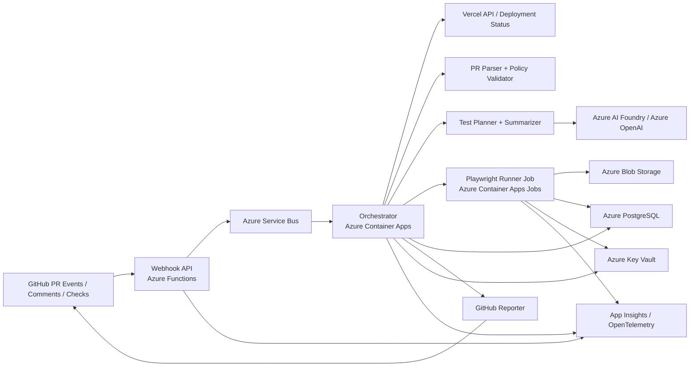

# Architecture

## Architecture goal

Build a production-ready, GitHub-native preview QA system that is:

- reliable
- auditable
- secure on untrusted PR previews
- cheap enough to run often
- extensible toward multi-tenant SaaS

---

## Recommended v1 stack

| Layer | Technology | Why |
|---|---|---|
| Git integration | GitHub App | Best productizable PR-native integration model |
| Webhook intake | Azure Functions | Fast, simple, scalable webhook handling |
| Queue / async events | Azure Service Bus | Reliable background orchestration |
| Orchestration | Azure Container Apps | Good middle ground before AKS |
| Browser execution | Azure Container Apps Jobs + Playwright | Ephemeral, scalable browser runners |
| AI layer | Azure AI Foundry / Azure OpenAI | Uses your Azure credits and provides secure model access |
| State store | Azure PostgreSQL | Durable metadata and run state |
| Retrieval later | `pgvector` | Cheap and simple semantic retrieval when needed |
| Artifacts | Azure Blob Storage | Screenshots, traces, videos, logs |
| Secrets | Azure Key Vault | Safe secret storage |
| Observability | App Insights + OpenTelemetry | Azure-native logs, traces, metrics |
| Infra as code | Terraform | Repeatable infrastructure |
| Preview source | Vercel API + GitHub deployment status | Reliable preview resolution |

---

## Architecture stance

### Build now
- deterministic runner
- structured PR instruction contract
- AI planning and summarization
- GitHub-native output
- Azure-native infra and observability

### Defer until product need is proven
- Neo4j knowledge graph
- OpenSearch hybrid search
- Temporal workflows
- AKS + ArgoCD
- broad multi-agent workflow frameworks

This is not because those tools are bad.
It is because the product will get more value early from **reliability** than from **infrastructure sophistication**.

---

## Layered system design

### 1. Integration layer
Handles external systems:
- GitHub
- Vercel
- Azure AI Foundry / Azure OpenAI

### 2. Control plane
Owns:
- webhook validation
- event normalization
- state transitions
- retry handling
- run coordination
- reporting back to GitHub

### 3. Intelligence layer
Owns:
- PR instruction parsing
- plan generation
- risk summary
- failure explanation
- future repo-context enrichment

### 4. Execution layer
Owns:
- Playwright browser jobs
- auth/session bootstrap
- artifacts
- structured results

### 5. Observability and governance layer
Owns:
- logs
- traces
- metrics
- alerts
- auditability
- secret access policies

---

## High-level component diagram

---

## Core components

| Component | Responsibility |
|---|---|
| GitHub App | Receives PR events, PR comments, and check interactions |
| Webhook API | Validates signatures, normalizes events, acknowledges quickly |
| Event Queue | Buffers work and decouples intake from execution |
| Orchestrator | Owns workflow state machine and retries |
| Preview Resolver | Resolves latest valid Vercel preview URL for PR head SHA |
| PR Parser | Extracts structured QA block from PR description |
| Policy Validator | Applies repo rules, fork policy, missing field checks |
| Planner | Converts validated instructions into normalized executable plan |
| Runner | Executes Playwright plan against preview |
| Artifact Manager | Stores traces, screenshots, videos, logs |
| Failure Analyst | Summarizes failures and classifies root cause |
| Reporter | Updates GitHub Check and sticky PR comment |
| State Store | Stores installations, repos, PRs, runs, plans, results |
| Observability Layer | Metrics, traces, logs, alerts |

---

## High-level data model

| Entity | Purpose |
|---|---|
| installation | GitHub App installation metadata |
| repository | onboarded repo metadata and config |
| pull_request | normalized PR record |
| run | one QA run for a PR head SHA and mode |
| plan | normalized test plan generated from PR instructions |
| test_case | executable test case metadata |
| result | summarized outcome and classification |
| artifact | screenshot/trace/video/log references |
| comment_record | sticky PR comment tracking |
| model_trace | planner/summarizer metadata |
| audit_event | security and workflow audit log |

---

## Main request flow

1. PR event arrives from GitHub.
2. Webhook API validates signature.
3. Event is normalized and put on Service Bus.
4. Orchestrator loads repo config and PR metadata.
5. Orchestrator resolves preview URL from Vercel/GitHub deployment data.
6. PR instructions are parsed and validated.
7. Planner creates normalized test plan.
8. Playwright runner job is launched with preview URL and plan.
9. Runner uploads artifacts and structured result.
10. Analyst summarizes failures and risk.
11. Reporter updates GitHub Check and sticky PR comment.
12. Run metadata is stored for future retrieval and analytics.

---

## Key architecture decisions

### ADR-001: Use a GitHub App, not only GitHub Actions
A GitHub App is the right product foundation because it supports:
- multi-repo installation
- fine-grained permissions
- webhook-driven workflows
- better SaaS productization
- stable PR-native UX

GitHub Actions can still be used in customer repos for:
- CodeQL
- Semgrep
- unit/integration tests
- static PR checks

But the product core should not live only inside Actions.

### ADR-002: Use deterministic Playwright runners, not free-form browser agents
This product needs:
- repeatability
- artifacts
- stable selector behavior
- predictable pass/fail semantics

LLMs should guide plan creation and summarization, not directly drive every click with unconstrained exploration.

### ADR-003: Use Azure Container Apps before AKS
Container Apps gives:
- lower ops burden
- faster setup
- good enough scale for early stages
- simpler job-style Playwright execution

Move to AKS only when concurrency, network isolation, or custom scheduling demands it.

### ADR-004: Require structured PR instructions
Pure natural language is useful for fallback understanding, but not reliable enough as the canonical contract.
The system should parse a versioned structured block from the PR description.

---

## Repository-side baseline

Every target repo should still have normal engineering checks:

- unit tests
- integration tests
- Playwright suites where they already exist
- CodeQL
- Semgrep
- lint/type-check
- branch protection rules

Preview QA Agent is an additional layer, not the only quality control.

---

## Deferred technologies and adoption triggers

| Technology | Adopt when |
|---|---|
| LangGraph | planner/analyst workflows need branching, retries, or human approval loops |
| tree-sitter | repo-aware route/component extraction becomes important |
| SCIP / LSIF | symbol-level impact analysis is needed |
| `pgvector` | semantic retrieval across runs, PRs, and docs becomes useful |
| Neo4j | graph queries across files/routes/components/tests become central to product value |
| OpenSearch | multi-repo hybrid keyword + semantic search becomes necessary |
| Temporal | long-running workflows and manual approval checkpoints become a bottleneck |
| AKS / ArgoCD | Container Apps no longer meets concurrency, isolation, or ops needs |

---

## Model usage strategy

Use Azure AI Foundry / Azure OpenAI for:

### High-capability model
- plan normalization
- failure explanation
- risk summarization
- ambiguity detection

### Lower-cost model
- extraction
- labeling
- light classification
- formatting assistance

Do not hard-code model names in core logic.
Model deployment names should be configuration.

---

## Future intelligence roadmap

### Phase 2
- stronger planner
- retry-aware summarizer
- prompt regression testing

### Phase 3
- repo-context retrieval using:
  - file path heuristics
  - changed route detection
  - `pgvector`
- optional LangGraph orchestration

### Phase 4
- tree-sitter + SCIP ingestion
- impact-aware test suggestions
- historical run retrieval
- optional graph storage for advanced dependency reasoning