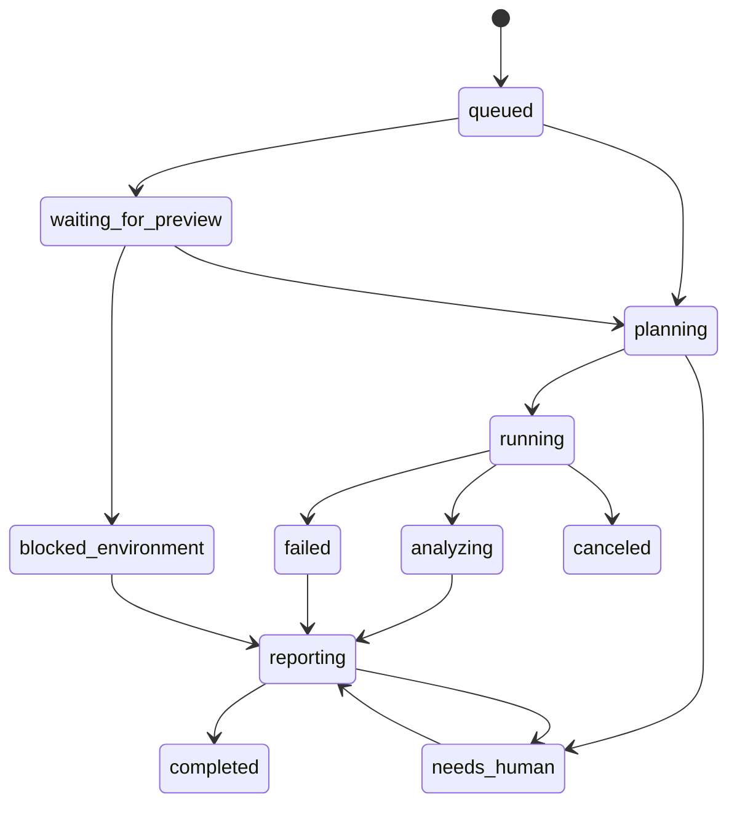

# Workflows

## Workflow goal

Define how Preview QA Agent behaves from the moment a PR is opened until the run is completed, blocked, canceled, or needs human clarification.

---

## Primary triggers

| Trigger | Source | Expected action |
|---|---|---|
| `pull_request.opened` | GitHub | create or update run |
| `pull_request.synchronize` | GitHub | cancel old in-progress run for prior SHA and create new run |
| `pull_request.reopened` | GitHub | re-evaluate and enqueue run |
| `issue_comment` with `/qa rerun` | GitHub | rerun latest plan on latest valid preview |
| `issue_comment` with `/qa smoke` | GitHub | run smoke mode |
| `issue_comment` with `/qa skip` | GitHub | mark PR as intentionally skipped if policy allows |
| deployment status success | GitHub/Vercel | wake waiting run if preview becomes ready |
| timeout poll | Orchestrator | re-check preview readiness until timeout |

---

## Run identity

A run is uniquely keyed by:

- installation
- repository
- PR number
- head SHA
- mode

Only one active run per key should exist at a time.

---

## Modes

| Mode | Meaning |
|---|---|
| `skip` | do not run browser QA |
| `smoke` | run minimal repo-configured smoke plan |
| `instruction` | run only explicit PR-defined cases |
| `hybrid` | run explicit PR-defined cases plus default smoke checks |
| `full` | run repo-defined broader suite; reserved for later or special repos |

---

## End-to-end lifecycle

### 1. Intake
- receive PR event
- validate installation/repo eligibility
- create or update run
- set GitHub Check to `queued`

### 2. Preview resolution
- try primary preview resolution strategy
- if preview not ready, move to `waiting_for_preview`
- retry using deployment events or polling
- if timeout expires, mark `blocked_environment`

### 3. Instruction parse and validation
- locate structured QA block in PR body
- validate YAML against schema
- apply repo policy
- if invalid:
  - request clarification
  - optionally fail intake if repo requires structured instructions

### 4. Plan generation
- normalize instructions into executable plan
- enrich with default smoke checks if mode requires it
- attach metadata:
  - target URL
  - login profile
  - risk areas
  - timeout settings
  - artifact policy

### 5. Runner execution
- create ephemeral Playwright runner job
- hydrate auth/session if required
- execute cases sequentially or in bounded parallelism
- collect screenshots, traces, logs, optional video
- persist structured results

### 6. Analysis
- classify failures:
  - product bug
  - test bug
  - environment issue
  - missing instruction
  - flaky or inconclusive
- generate concise explanation
- summarize risk for reviewer

### 7. Reporting
- update GitHub Check
- update sticky PR comment
- link artifacts
- store audit record

---

## State machine



---

## Canonical run states

| State | Meaning |
|---|---|
| `queued` | accepted but not started |
| `waiting_for_preview` | preview deployment not yet ready |
| `planning` | instructions being validated and normalized |
| `running` | Playwright job executing |
| `analyzing` | post-run classification/summarization |
| `reporting` | GitHub update in progress |
| `completed` | finished successfully |
| `failed` | run failed due to execution or platform issue |
| `blocked_environment` | preview unavailable or environment unusable |
| `needs_human` | ambiguous instructions or unsafe execution conditions |
| `canceled` | superseded by a newer commit or explicit user action |

---

## Sticky comment policy

Use **one sticky PR comment** per PR and update it rather than posting many comments.

Benefits:
- avoids PR noise
- keeps latest state visible
- makes reruns easier to follow

---

## GitHub Check policy

Use one check run named:

`previewqa`

The check summary should show:
- current state
- mode
- preview URL
- number of executed cases
- pass/fail/blocked outcome
- link to artifacts

---

## Preview resolution strategy

Priority order:

1. GitHub deployment status associated with the PR head SHA
2. Vercel API lookup by commit SHA / branch
3. repo-configured preview URL rule if needed

Always prefer the **latest successful preview for the current head SHA**.

If a new push updates the SHA:
- cancel or supersede prior runs
- resolve preview again for the new SHA

---

## Human-in-the-loop rules

Move to `needs_human` when:
- QA block is missing but required
- instructions are invalid or contradictory
- required login profile is unavailable
- run would require unsafe actions not allowed by policy
- fork PR attempts authenticated flow
- preview is reachable but clearly unusable for testing

---

## Failure taxonomy

| Category | Meaning | Expected action |
|---|---|---|
| `product_bug` | app behavior appears incorrect | report as failing test with evidence |
| `test_bug` | selector/test logic is wrong | report platform issue, not app defect |
| `environment_issue` | preview/auth/data problem | mark blocked/inconclusive |
| `needs_clarification` | instruction ambiguity | ask PR author for update |
| `flaky` | inconsistent result across retry | mark inconclusive or warn |

---

## Retry policy

### Safe automatic retries
- network timeout
- transient browser crash
- preview boot race condition
- one-off element attach timing issue

### No silent automatic retries for
- clearly failing business assertion
- missing selector due to real UI change
- authentication denied
- unsafe forked preview auth

Default retry philosophy:
- one lightweight retry for transient infrastructure issues
- no repeated retries that mask genuine failures

---

## PR comment commands

### v1 commands
- `/qa rerun`
- `/qa smoke`
- `/qa help`

### v2 candidate commands
- `/qa full`
- `/qa explain`
- `/qa focus <area>`
- `/qa cancel`

---

## Example PR result comment

```md
## Preview QA Result: Failed

- **Mode:** hybrid
- **Preview:** https://example-pr-123.vercel.app
- **Head SHA:** abc1234
- **Executed Cases:** 4
- **Passed:** 3
- **Failed:** 1
- **Status:** product_bug

### Failure summary
The checkout confirmation toast did not appear after clicking the final submit button.

### Evidence
- Screenshot: [link]
- Trace: [link]
- Logs: [link]

### Suggested next step
Inspect the checkout submit handler and confirmation state update for the new pricing flow.
```

---

## Cancellation rules

Cancel in-progress run when:
- PR gets a new commit SHA
- repo policy changes to skip
- user explicitly cancels in future versions
- preview URL becomes invalid due to superseded deployment

---

## Minimal v1 behavior on missing instructions

If structured instructions are missing:

- if repo policy is `required`: mark `needs_human`
- otherwise:
  - run default smoke only
  - comment that structured QA instructions are recommended